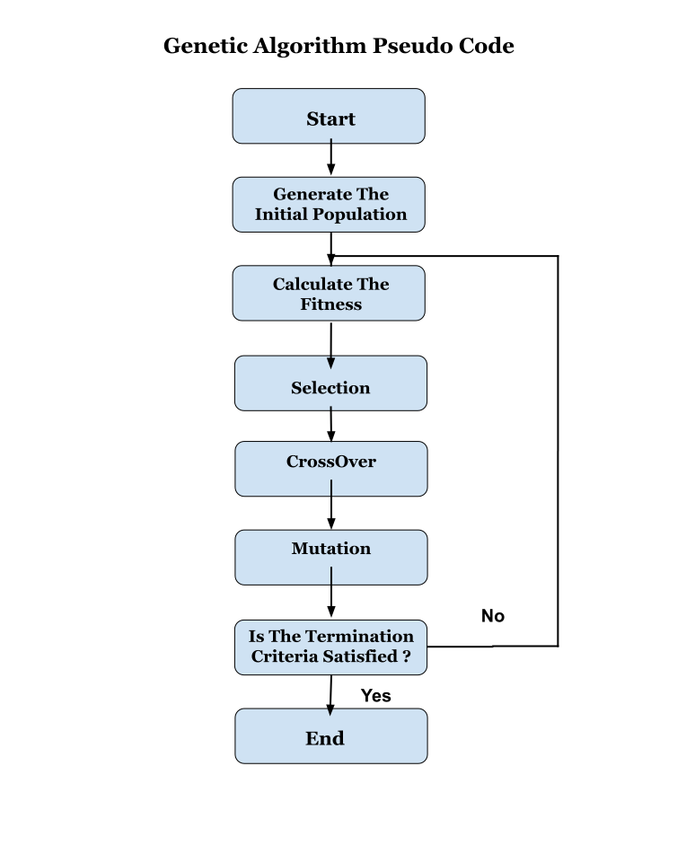
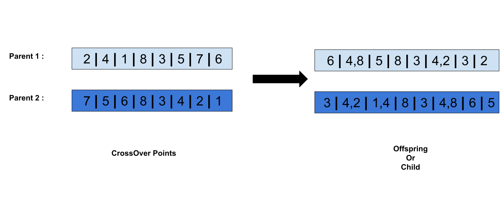
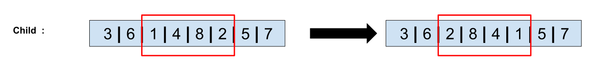

# Genetic Algorithm Explained

<p>
In This Article i will try to give an Introduction to Genetic Algorithm , and we will see how can we use it to solve some very complicated Problems .

<div align="center" >

</div>

## Article Summary :

1. Genetic Algorithm Definition . 
2. Genetic Algorithm PseudoCode .
3. essential Terms :        
        3.1. Population . <br/>
        3.2. Chromosome . <br/>
        3.3. Gene . <br/>
        3.4. Encoding Methods . <br/>
        3.5. Fitness Function . <br/>
        3.6. Termination Criteria . <br/>
4. Genetic operators : <br/>
        4.1. Selection . <br/>
        4.2. CrossOver . <br/>
        4.3. Mutation . <br/>
5. Applications : <br/>
   5.1. Using Genetic Algorithm to Optimize a Mathematical Function . <br/>
   5.2. Using Genetic Algorithm to Optimize a Neural Network . <br/>
   5.3. Using Genetic Algorithm to Solve The Travelling Salesman Problem . <br/> 
6. References . <br/>   

</p> 


## 1. Genetic Algorithm Definition :
<p>
Genetic algorithm (GA) is a metaheuristic inspired by the process of natural selection
that belongs to the larger class of evolutionary algorithms (EA). Genetic algorithms are 
commonly used to generate high-quality solutions to optimization and search problems by
relying on biologically inspired operators such as mutation, crossover and selection . 
</p>

## 2. Genetic Algorithm PseudoCode :

<div align="center" >

</div>

## 3. essential Terms :

### 3.1 Population : 
A population is a group of individuals or Chromosomes and each individual is a candidate solution to The problem.

<div align="center" >

</div>

### 3.2 Chromosome  :
A Chromosome is An individual that contains a set of parameters known as Genes (take a look at the figure above).

### 3.3 Gene :
A Chromosome Contains a list of Parameters , this parameters we call them genes (take a look at the figure above) .

### 3.4 Encoding Methods  :  

* Binary Encoding : This is The most common method of encoding , where we represents a Chromosome with a String of bits (0 and 1) , this method used to solve problems like knapsack problem and Optimizing a Mathematical Functions (we will se an Example later) .

<div align="center" >

</div>  

* Value Encoding : represents a Chromosome as a set of values , for Example we can use this encoding to optimize a neural network , to find the best weights and biases for our network (we will see an Example later ).

<div align="center" >

</div>

* Order Encoding : Each Chromosome represents a sequence of Elements , Used in Problems such as Travelling Salesman problem (we will see an Example later ). 

<div align="center" >

</div>

### 3.5 Fitness Function :  
A fitness function is a particular type of objective function which takes as input a candidate solution and outputs the quality of this solution, therefore the fitness function makes it possible to evaluate the candidate solutions .

<div align="center" >

</div>

### 3.6 Termination Criteria : 

The Reproduction process is repeated until a termination condition has been reached , common terminating conditions are .

* A solution is found that satisfies minimum criteria .
* Fixed number of generations reached .
* Allocated budget (computation time/money) reached .
* Manual inspection .
* Combinations of the above .

## 4. Genetic operators :<br>
### 4.1 Selection :  
Selection is the process of selecting parents to generate the Child we call it also offspring that will be a part of the next generation , There are several selection methods among the most used we have :

* **Elitism Selection :** Elitism Selection Consists of Selecting Top K chromosomes to pass them To The Next Generation without making any any changes to them .

* **Roulette Wheel Selection :** each parent is represented in The wheel with a portion depends on his Fitness Value , The Parent with the Best Fitness Value have the best chance to be selected .

<div align="center" >

</div> 

* **Stochastic Universal Sampling Selection (SUS Selection) :** Stochastic Universal Sampling is Very similar to Roulette Wheel , but in Sus Selection we use more than one Fixed Point . 

<div align="center" >

</div>

* **Tournament Selection :** The First Thing We do is we choose a Number K that represents The Tournament Pool Size , then We select K individuals from The Current Population and we put Them into the Pool , After This we Choose The Best Individual from our Pool (The Individual that have the best Fitness Value ) .

<div align="center" >

</div>

* **Rank Selection :** when the problem is very close to converge , The individuals in our Population have a very close Fitness Value , if we use Roulette wheel , they will have the same probability to be selected , we need to represents our chromosomes in The Wheel Using Different Parameter , instead of Using The Fitness Value  we will Use The Rank  ,  so that the chromosomes that have a good ranking they will have a better chance to be selected .


### 4.2 CrossOver : 
The crossing operation is the Process of reproduction of new chromosomes from the parent chromosomes (parents are selected from the old population Using A Selection Method ) , There are several crossing methods among the most used we have :

* **One Point Crossover :** a random Point is chosen to be The CrossOver Point , then we fill the child with genes from both parents 

<div align="center" >

</div>

* **Multi Point Crossover :** a random two Points are chosen to be The CrossOver Points , then we fill the child with genes from both parents 

<div align="center" >

</div>

* **Davis Order Crossover (OX1) :** we Choose two random crossover points in the first  parent and we copy that segment into the Child , then we fill the rest  of genes in our child with the genes from the second Parent .

<div align="center" >

</div>

* **Uniform CrossOver :** we flip a coin for each genes in our two parents to decide whether or not it’ll be included in the off-spring (Child ).

<div align="center" >

</div>

* **Whole Arithmetic Recombination :** we use this two formula to forms our two children .
```python
Child1 = α.x + (1-α).y
Child2 = α.x + (1-α).y
```
Then we Choose The Best Child (The Child with The Best Fitness Value ).

<div align="center" >

</div>

### 4.3 Mutation :  
the mutation can be defined as a small random modification of the chromosome, to obtain a new solution. It is used to maintain and introduce diversity in the genetic population and is generally applied with a low probability we call it P_m , There are several methods of mutation among the most used ones we have .

* **Bit flip Mutation :** we select one or more random points (Bits) and flip them. This is used for binary encoded Genetic Algorithms .

<div align="center" >

</div>

* **Swap Mutation :** we Choose two Point and we switch them .

<div align="center" >

</div>

* **Scramble Mutation :** we choose a random segment in The Current Chromosome and we interchange the values .

<div align="center" >

</div>

* **Mutation Inversion :** we choose a random segment in The Current Chromosome and we reverse The Order of the values .

<div align="center" >

</div>

## 5. Applications :

### 5.1 Using Genetic Algorithm to Optimize a Mathematical Function . 

in This Example we will Use Genetic Algorithm to Optimize this Mathematical Function : </b>

```
f(x) = x^2 +2x -1
```

but before going further we need to answer this questions :

<b>Which Encoding Method will use to encode our chromosomes ? </b>
 
<p>
    we will Use Binary Encoding . 
</p>


<b>what is The Fitness Function that we will use to evaluate our candidate Solutions ? </b>
<p>
    The Fitness Function in Our Case is The Same Function f .
</p>

<b>which Selection Method will use ? </b>
<p>
    we will use Elitism Selection Combined with Tournament Selection .
</p>

<b>which CrossOver Method will use ? </b>
<p>
    we will use the most simplest crossOver Method , which is One Point CrossOver .  
</p>

<b>which Mutation Method will use ? </b>
<p>
    we used Binary Encoding to encode our chromosomes , this is why we will use Bit Flip Mutation .
</p>

<b>which termination criteria will use ? </b>
<p>
    we will use The Number of generations as a termination criteria .
</p> 

<b> Implementation : </b>

* The Chromosomes are represented with this class : 
```python
    
    class Chromosome :
    
    def __init__(self , lenght , function):
        self.genes = ""
        self.function = function
        for i in range(lenght):
            self.genes += str(random.randint(0, 1)) 
        self.calculateTheFitness()    
    
    def calculateTheFitness(self):
        decimalValueOfGenes = self.convertToDecimal()
        fitnessValue = self.function(decimalValueOfGenes)
        self.fitness = fitnessValue
        
    def convertToDecimal(self):
        decimal = sum([pow(2 , i) * int(x) for x,i in zip(self.genes , reversed(range(len(self.genes))))])
        return decimal
    
```

* The Population In Our Case is Represeted with this class : 

```python

    class Population :
    
    def __init__(self , populationSize , chromosomeSize , function , init):
        self.chromosomes = []
        if init :
            self.chromosomes = [Chromosome(chromosomeSize , function) for i in range(populationSize)]
            self.chromosomes.sort(key = lambda x:x.fitness)
            self.fittest = self.chromosomes[0]
    
    def getNFittestChromosomes(self, n):
        self.chromosomes.sort(key = lambda x:x.fitness)
        return self.chromosomes[:n]
    
    def findTheFittest(self):
           self.chromosomes.sort(key = lambda x:x.fitness)
           self.fittest = self.chromosomes[0]
    
    def calculateTheFitnessForAll(self):
        for chromosome in self.chromosomes:
            chromosome.calculateTheFitness()

```

* The Genetic Algorithm is Represeted with This Class : 


```python

    class GeneticAlgorithm : 
    
    def __init__(self , populationSize , chromosomeSize , tournamentSize , elitismSize , mutationRate , function):
        self.populationSize = populationSize
        self.chromosomeSize = chromosomeSize
        self.tournamentSize = tournamentSize
        self.elitismSize    = elitismSize
        self.mutationRate   = mutationRate
        self.function       = function
    
        
    def reproduction(self , population):
        temp = []
        temp[:self.elitismSize] = population.getNFittestChromosomes(self.elitismSize)
        for i in range(self.elitismSize , self.populationSize):
            parent1 = self.tournamentSelection(population)
            parent2 = self.tournamentSelection(population)
            
            child = self.onePointCrossOver(parent1, parent2)
            
            self.bitFlipMutation(child)
            
            temp.append(child)
            
        newPopulation = Population(self.populationSize, self.chromosomeSize, self.function, False)
        newPopulation.chromosomes = temp
        newPopulation.findTheFittest()
        newPopulation.calculateTheFitnessForAll()
        return newPopulation
        
    
    def bitFlipMutation(self , child):
        if random.random() < self.mutationRate :
            mutationPoint = random.randint(0, len(child.genes) -1)
            geneslist = list(child.genes)
            geneslist[mutationPoint] = "0" if geneslist[mutationPoint] == "1" else "1"
            child.genes = ''.join(geneslist)
            child.calculateTheFitness()
    
    def tournamentSelection(self , population):
        tournamentPool = []
        for i in range(self.tournamentSize):
            index = random.randint(0, len(population.chromosomes) -1)
            tournamentPool.append(population.chromosomes[index])
        tournamentPool.sort(key = lambda x:x.fitness)
        return tournamentPool[0]
    
    def onePointCrossOver(self , parent1 , parent2):
        temp = []
        crossOverPoint = random.randint(0, len(parent1.genes) -1)            
        temp[:crossOverPoint] = parent1.genes[:crossOverPoint]
        temp[crossOverPoint:] = parent2.genes[crossOverPoint:]
        child = Chromosome(7, self.function)
        child.genes = ''.join(temp)
        child.calculateTheFitness()
        return child

```

* The Main class : 

```python

     #function to be Optimize        
    def f(x):
        return pow(x, 2) + 2 * x - 1
    
    # plot The Function in the interval [-256 , 256] .
    x = np.arange(-256,256,1)
    plt.plot(x , f(x))
    
    #Generate The   Initial Population
    initialPopulation = Population(populationSize = 20, chromosomeSize = 10, function = f, init = True)    
    """
    Create an Instance of Genetic Algorithm with this Parameters : 
        * pop_size = 20 
        * chromosome_Size = 8 (as I mentioned before, we will try to optimize the function f in this range [-256, 256], and 8 bits are enough to encode 256.) 
        * tournament_Pool_size = 4 
        * elitism_size = 4 
        * mutation_rate = 0.1 
        * and Finally the Function to be Optimize
    """
    GeneticAlgo = GeneticAlgorithm(populationSize = 20, chromosomeSize = 10, tournamentSize = 4, elitismSize = 5, mutationRate = 0.1, function = f)
    
    
    population = initialPopulation
    # repeat The Process 50 times , 50 is the number of generations .
    for i in range(50):    
        x_i = population.fittest.convertToDecimal()
        f_x_i = f(x_i)
        plt.scatter(x_i, f_x_i, color='red')
        population = GeneticAlgo.reproduction(population)

```
Genetic Algorithm gives as this result which very good , I intentionally choose a small population size, so we can see the steps, because the genetic algorithm is very fast to optimize this simple function that we have  , if we use a large population size .

<div align="center" >

</div>


### 5.2 Using Genetic Algorithm to Optimize a Neural Network .


```python
    Using Genetic Algorithm to Optimize a Neural Network
```

### 5.3 Using Genetic Algorithm to Solve The Travelling Salesman Problem .

In This Example we will use The Genetic Algorithm to solve The travelling salesman problem  (TSP) , which is an NP-hard problem in combinatorial optimization , we can represent the TSP with this Question :
"Given a list of cities and the distances between each pair of cities, what is the shortest possible route that visits each city exactly once and returns to the origin city?"

<div align="center" >

</div>

The Travelling Salesman can ve expressed using This Formula , with T[i] is a candidate Trajectory to our Problem  :

<div align="center" >

</div>

but before going further we need to answer this questions :


<b> What Would The Genes be in our case ? </b>
<p>
    the genes in our case are represented as Cities . 
</p>

<b> What Would The Chromosomes be in our case ? </b>
<p>
    The Chromosomes in our case are represented as Tours (candidate trajectories)  .
</p>

<b> What Would The Population be in our case ? </b>
<p>
    The Population In Our case is represented as a list of Tours .
</p>

<b>Which Encoding Method will use to encode our chromosomes ? </b>
<p>
    we will Use Order Encoding , because we're looking for a specific Order of cities that will give us The Shortest Path . 
</p>
<b>what is The Fitness Function that we will use to evaluate our candidate Solutions ? </b>

<p>
    The Fitness Function in Our Case is The function that calculate the Distance of candidate path , which is represented as bellow :
    <div align="center" >
    
    </div>
    with d(T[i] , T[j]) is the euclidean distance function , that give us the distance between the city number i and the city number j in The T trajectory , we can express this function using this formula :
    <div align="center" >
    
    </div>
</p>

<b>which Selection Method will use ? </b>
<p>
    we will use Elitism Selection Combined with Tournament Selection , if chose 100 to be The Population Size , then we will take 20% of this size Using Elitism Selection and The Rest (80%) Using Tournament Selection .
</p>
<b>which CrossOver Method will use ? </b>
<p>
    we will Use Davis Order CrossOver Method (OX1).
</p>
<b>which Mutation Method will use ? </b>
<p>
    We used order coding to encode our own chromosomes, the most convenient method for mutation to use is Swap switch.
</p>

<b>which termination criteria will use ? </b>

<p>
    we will use The Number of generations as a termination criteria .
</p>

<b> Implementation : </b>

* Gene class (City):

```python
from math import sqrt , pow

class city:

    def __init__(self,id,x,y):
        self.id = id
        self.x = x
        self.y = y
    
    def __str__(self):
        return "city {" + str(self.id) + " , " + str(self.x) +" , " + str(self.y) + "}"
    
    def getDistance(self,c):
        if self != None and c != None :
            distance = sqrt( pow(self.x - c.x , 2) + pow(self.y - c.y , 2))
            return distance    
```

* Chromosome class (Tour):

```python
import DataSet

class tour :

    def __init__(self , init):
        self.nbrCities = DataSet.getNbrCities()
        self.cities = [None] * self.nbrCities
        if init :
            self.initTour()
            self.fitness = self.calculateFitness()
        
    def __str__(self):
        path = ""
        for i in range(self.nbrCities):
            if i != self.nbrCities -1 :
                path += str(self.cities[i].id) + " -> "
            else :
                path += str(self.cities[i].id) + " . "             
        return path                   

    def initTourWithNone(self):
        for i in range(self.nbrCities):
            self.cities.append(None)
    
    def initTour(self):
        for i in range(self.nbrCities):
                city = DataSet.getRandomCity()
                while self.contain(city) :
                    city = DataSet.getRandomCity()
                self.cities[i] = city   

    def contain(self,city):
        for i in range(self.nbrCities):
            if self.cities[i] != None :
                if self.cities[i].id == city.id :
                    return True
        return False

    def getIndexOf(self,city):
        for i in range(self.nbrCities):
            if self.cities[i] == city.id :
                return i
        return -1        

    def calculateFitness(self):
        self.fitness = 0
        for i in range(self.nbrCities -1):
            self.fitness += self.cities[i].getDistance(self.cities[i+1])
        self.fitness += self.cities[len(self.cities) -1].getDistance(self.cities[0])
   
    def compare(self, other):
        return 1 if self.fitness < other.fitness else -1       

```

* Population class (list of Tours):

```python
from Tour import tour

class population :

    def __init__(self,populationSize,init):
        self.popSize = populationSize
        self.tours = [None] * self.popSize
        if init :
            self.initPopulation()
            self.calculateFitnessForAll()
            self.sortPopulation()           
            self.fittest = self.tours[0]
                
        

    def initPopulation(self):
        for i in range(self.popSize):
            self.tours[i] = tour(True)                

    def initPopulationWithNone(self):
        for i in range(self.popSize):
            self.tours.append(None)

    def sortPopulation(self):
        for i in range(self.popSize-1):
            index = i
            for j in range(i+1 , self.popSize):
                if self.tours[j].compare(self.tours[i]) > 0 :
                    index = j 
            tmp = self.tours[i]
            self.tours[i] = self.tours[index]
            self.tours[index] = tmp
    
    def getFittestTour(self):
        return self.fittest

    def getNFittestTour(self,n):
        return self.tours[:n]

    def calculateFitnessForAll(self):
        for i in range(self.popSize):
            self.tours[i].calculateFitness()        
```

* Genetic Algorithm class :

```python
import matplotlib.pyplot as plt
import numpy as np
from Population import population
from Tour import tour
import random


class geneticAlgorithm :

    def __init__(self,nbrGenerations,popSize,elitismSize,poolSize,mutationRate):
        self.nbrGenerations = nbrGenerations
        self.popSize = popSize
        self.elitismSize = elitismSize
        self.poolSize = poolSize
        self.mutationRate = mutationRate
        self.initialPopulation = population(self.popSize , True)
        self.fitnesses = np.zeros(self.nbrGenerations)
        print("Initial Fitness : " , self.initialPopulation.fittest.fitness)
        print("Best Tour : ",self.initialPopulation.fittest)
        newPopulation = self.initialPopulation
        generationCounter = 0
        for i in range(self.nbrGenerations):
            newPopulation = self.reproduction(newPopulation)
            self.fitnesses[generationCounter] = newPopulation.fittest.fitness
            generationCounter += 1

            print("Generation : ", generationCounter  )
            print("Fitness : ", newPopulation.fittest.fitness)
            print("Best Tour : ",newPopulation.fittest)
            print("\n\n")


        self.displayTheResult()    

    def reproduction(self,pop):
        newpop = population(pop.popSize,False)
        elitismSubPopulation = self.elitismSelection(pop)
        
        
        for index in range(self.elitismSize):
            newpop.tours[index] = elitismSubPopulation[index]
        
        for i in range(index , pop.popSize): 
            parent1 = self.touranmentSelection(pop)
            parent2 = self.touranmentSelection(pop) 
              
            child = self.Ox1CrossOver(parent1, parent2)

            self.SwapMutation(child)
            child.calculateFitness()
            newpop.tours[i] = child
        
        newpop.calculateFitnessForAll()
        newpop.sortPopulation()
        newpop.fittest = newpop.tours[0]
        return newpop

    def elitismSelection(self,pop):
        pop.sortPopulation()
        elitismSubPopulation = pop.tours[:self.elitismSize + 1]
        return elitismSubPopulation

    def touranmentSelection(self,pop):
        pool = [None] * self.poolSize
        for i in range(self.poolSize):
            index = random.randint(0,self.popSize -1)
            pool[i] = pop.tours[index]
        self.sortSubPopulation(pool)
        return pool[0]

    def sortSubPopulation(self,sub):
        for i in range(self.poolSize):
            index = i
            for j in range(i+1 , self.poolSize):
                if sub[j].compare(sub[i]) > 0 :
                    index = j 
            tmp = sub[i]
            sub[i] = sub[index]
            sub[index] = tmp
    
    def Ox1CrossOver(self,parent1,parent2):
        child = tour(False)

        start = random.randint(0,parent1.nbrCities)
        end   = random.randint(0,parent1.nbrCities)

        
        while start >= end :
              start = random.randint(0,parent1.nbrCities)
              end = random.randint(0,parent1.nbrCities)      
        
        for i in range(start,end):
            child.cities[i] = parent1.cities[i]            
        
        for i in range(parent2.nbrCities):
            if not child.contain(parent2.cities[i]) :
                for j in range(parent2.nbrCities):
                    if child.cities[j] is None :
                        child.cities[j] = parent2.cities[i]
                        break
        return child

    def SwapMutation(self,child):
        for i in range(child.nbrCities):
            mutationProbability = random.random()
            if mutationProbability < self.mutationRate :
                    mutationPoint = random.randint(0 , child.nbrCities -1)
                    tmp = child.cities[mutationPoint]
                    child.cities[mutationPoint] = child.cities[i]
                    child.cities[i] = tmp

    def displayTheResult(self):
        x = np.arange(0,self.nbrGenerations)
        plt.plot(x,self.fitnesses)
        plt.xlabel("Generation")
        plt.ylabel("Fitness")
        plt.title("Fitness Value Over Generations ")
        plt.show()
```

* The Main:

```python
from GeneticAlgorithm import geneticAlgorithm
import DataSet

DataSet.readDataSet("_Berlin52.txt")

ga = geneticAlgorithm(nbrGenerations = 200,popSize = 200 ,elitismSize = 25 ,poolSize = 10 ,mutationRate = 0.1 )
```

* Dataset class : I made The DataSet Class specifically to read a specific dataset from a folder containing a list of datasets.

```python
from City import city
import random
import os

cities = []
def readDataSet(filename):
    dir_path = os.path.dirname(os.path.realpath(__file__))
    file_path = dir_path + "\DataSets\\" + filename
    with open(file_path , "r") as f:
        for line in f:
            id  = int(line.split()[0].strip())  
            x   = float(line.split()[1].strip())  
            y   = float(line.split()[2].strip('\n'))

            cities.append(city(id,x,y))

def getNbrCities():
    return len(cities)


def getRandomCity():
    index  = random.randint(0,getNbrCities()-1)   
    return cities[index]
```
* Genetic Algorithm Result :

<p> 
In This Example we used Berlin52 Dataset , which is a public dataset for TSP problem that contains 52 cities .
The best path in the first generation was with a distance of 23356,380859 km, and after 200 generations we had a better path with a distance of 11872,086914 km.
</p>

<div align="center" >
    
</div>


## 6. References :

* [Genetic Algorithms Book By David E Goldberg](https://scholar.google.com/citations?view_op=view_citation&hl=en&user=BUzKxsoAAAAJ&citation_for_view=BUzKxsoAAAAJ:3x-KLxxGyuUC).
* [Genetic Algorithm By Wikipedia](https://en.wikipedia.org/wiki/Genetic_algorithm) .
* [Evolutionary algorithm By Wikipedia](https://en.wikipedia.org/wiki/Evolutionary_algorithm)